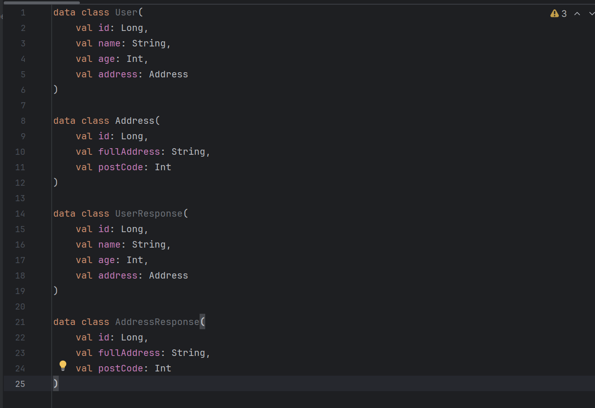
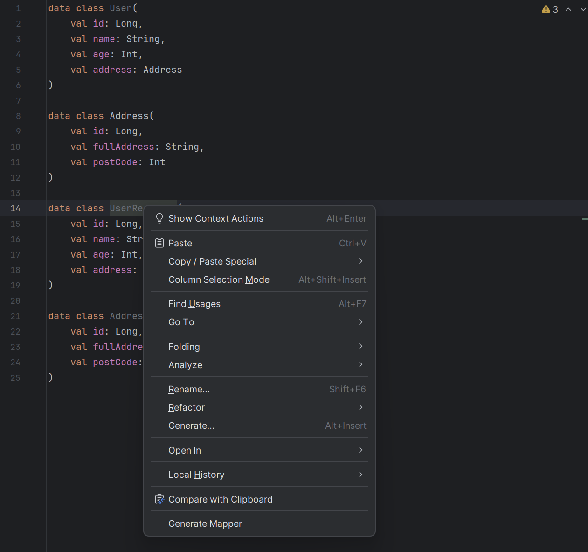
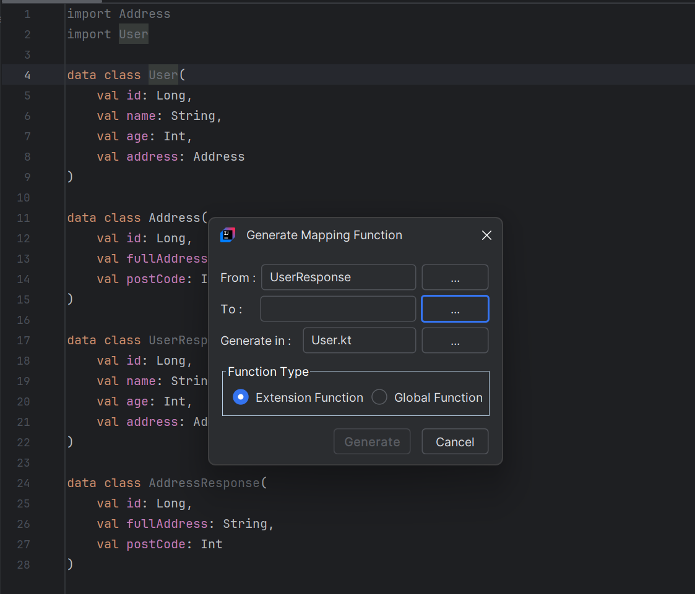
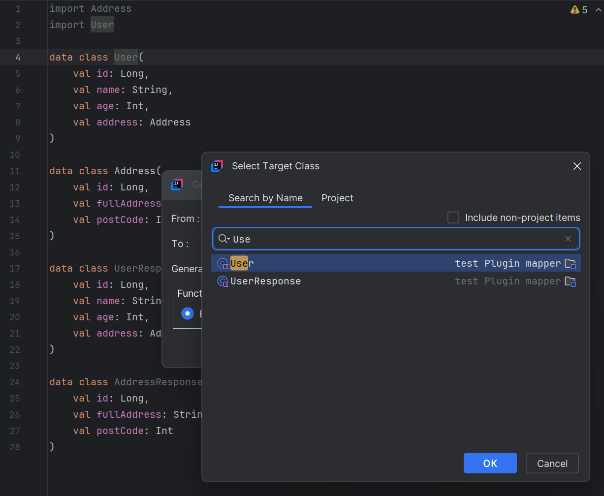
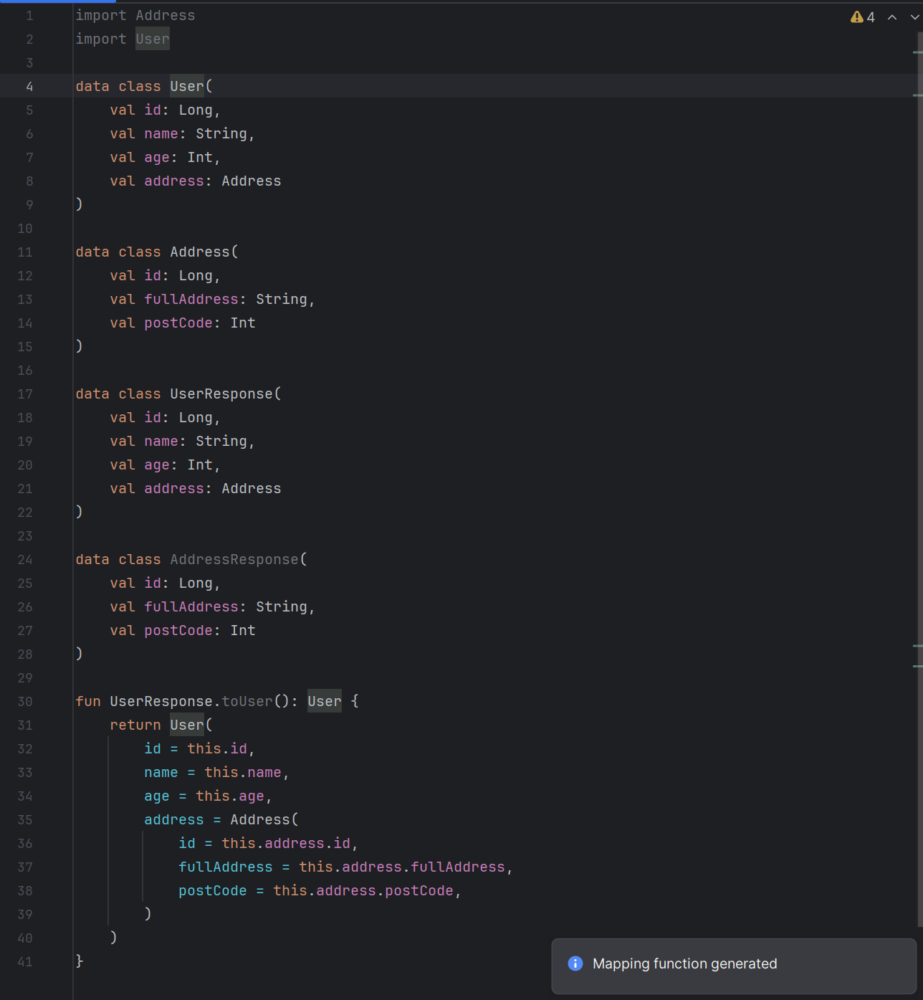

# **MapCraft** plugin for mapping object

### Description

The MapCraft plugin is a productivity tool for IntelliJ IDEA and Android Studio designed to streamline the creation of object-to-object mappers in your Kotlin or Java projects. Whether you need to map between DTOs, entities, models, or custom objects, this plugin automates the tedious process of writing boilerplate mapping code.
Key Features:

- Automatic Mapper Generation: Generate mapper functions with just a few clicks.
- Easy-to-Use UI: A user-friendly interface for selecting source and target     objects and fine-tuning the mappings.

Benefits:

- Save time and reduce boilerplate when working with complex models.
- Automatic mapping of nested classes.
- Improve code quality by eliminating human errors in manual mapping.
- Focus on business logic rather than repetitive tasks.

Ideal For:

- Backend developers working with data transformation layers.
- Android developers mapping between network, domain, and UI models.
- Any developer tired of writing repetitive mapper code manually.    

Boost your development efficiency and eliminate mapping headaches with MapCraft!

### How to install

Go File -> Settings -> Plugins -> Enter in search field MapCraft -> Install

### Supported IDE

Supported Products
Android Studio — Android Studio Ladybug  2024.2.1, Jellyfish | 2023.3.1+
Aqua — 2024.1.1+
IntelliJ IDEA Community — 2023.3+
IntelliJ IDEA Ultimate — 2023.3+

### How to use

Let's say you have data classes

Right click on the class you want to be source of mapping. And push button  Generate Mapper

Push button ellipsis to select target class

Select target class

You can see generated function

